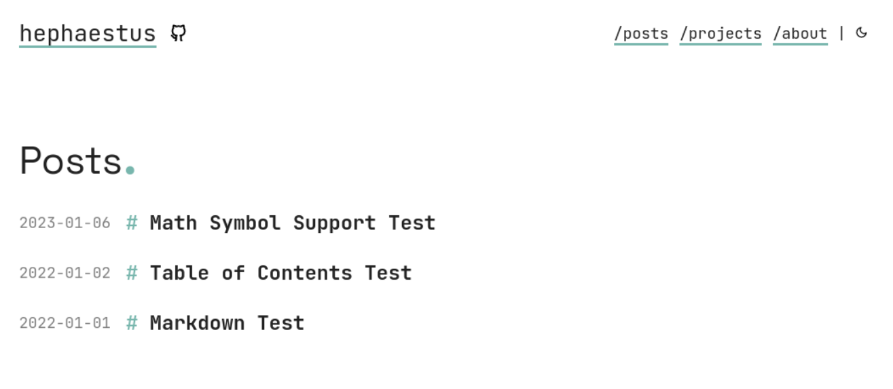
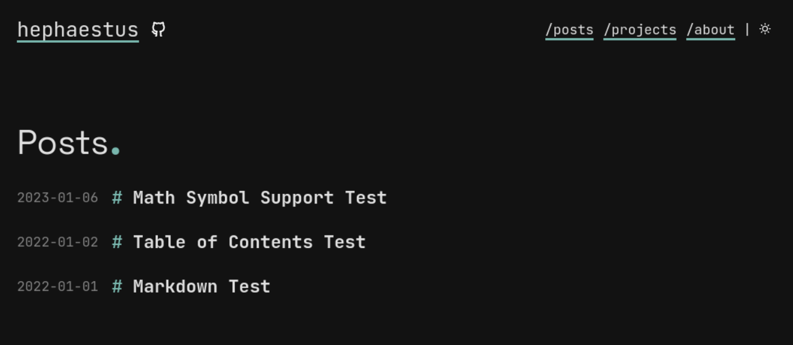

# Rigr

A simple & modern nordic theme powered by [Jekyll](https://jekyllrb.org).
See a live preview [here](https://vhdirk.github.io/rigr-jekyll).

The name Rigr is taken from [Rígsþula](https://en.wikipedia.org/wiki/R%C3%ADgs%C3%BEula).

  
Light theme

  
Dark theme

  

## Features

Not a lot. I simply use this for very simple gh-pages

## References

This theme is based on [apollo](https://github.com/not-matthias/apollo).
